# 🚆 UK Train Rides Dashboard – Insight Hunters 📊

> _"Hunting the Unknown, Revealing the Unseen!"_

A full-scale Power BI project analyzing over **1.8 million UK train journeys** to uncover patterns in **delays**, **sales**, **customer experience**, and **operational efficiency**. This interactive dashboard suite enables transportation analysts and decision-makers to act on real-time KPIs and business intelligence.

---

## 🧑‍💼 Team Overview

| Member Name                            | Role(s)                                                   | Background            | Governorate |
| -------------------------------------- | --------------------------------------------------------- | --------------------- | ----------- |
| **Mazen Moustafa Sayem Abdel-tawwab**  | Team Leader, Dashboard Designer, Data Cleaning & Modeling | Computer Science & AI | Al Fayoum   |
| **Shahd Noman Esawy Esawy**            | Operational Dashboard Developer                           | Commerce (Accounting) | Al Beheira  |
| **Asmaa Salah Mohamed Alhady**         | Executive Summary & Strategic Dashboard                   | Statistics            | Al Sharqia  |
| **Abdallh Mohamed Abdelmonem Soliman** | Home Page & Navigation                                    | Computer Science (AI) | Al Dakahlia |
| **Saif Mohammed Godah**                | Analytical Dashboard Developer                            | Computer Science      | Al Dakahlia |

---

## 🎯 Objectives

- ✅ Detect and visualize major **delay reasons** and associated **costs**
- ✅ Monitor **real-time journey statuses** (on-time, delayed, canceled)
- ✅ Break down **ticket class distributions** and **purchase patterns**
- ✅ Reveal **high-traffic routes and stations**
- ✅ Forecast **seasonal demand** to guide staffing and resources
- ✅ Build a scalable **Star Schema data model**

---

## 📈 Business Questions Addressed

### 📊 Analytical Dashboard
- What are the most used **departure and arrival stations**?
- How are **ticket classes** and **journey statuses** distributed?
- What is the **cost and frequency** of different delay reasons?

### 🎯 Strategic Dashboard
- How do **delays** impact **revenue and customer satisfaction**?
- What are the **monthly revenue trends** by purchase date?
- Which **ticket types and routes** generate the most revenue?

### ⚙ Operational Dashboard
- What is the **delay trend over time**, and during which hours?
- How much **revenue is lost due to delays**?
- What percentage of delays are due to **weather, signals, or staffing**?

---

## 🧼 Data Preparation

### 🔍 Cleaning Steps
- Replaced missing `Reason for Delay` with `"No Delay"` when status = "On Time"
- Kept `Actual Arrival Time` as null for canceled trips
- Verified datetime fields and calculated delay durations
- Removed duplicates and unnecessary calculated columns

### 🧠 Data Model – Star Schema

| Table | Description |
|-------|-------------|
| `Fact Transactions` | Central fact table (ticket sales, delays, routes) |
| `Dim Tickets` | Ticket class and type |
| `Dim Route` | Departure and arrival stations |
| `Dim Status` | Journey status, delay reasons |
| `Dim Calendar` | Purchase and journey date hierarchy |
| `Dim Buying Process` | Payment method and type |
| `Dim Railcard` | Customer segmentation |

---

## 💡 Key KPIs Tracked

- 🔢 **Total Number of Trips**
- 💰 **Total Revenue & Cost of Delays**
- 🕒 **Average Delay Duration (minutes)**
- 📉 **Revenue Lost Due to Delays**
- 📆 **Trip Distribution by Day and Month**
- 🧾 **Refund Requests due to Delays**
- 🎟️ **Ticket Sales by Class**
- 🚆 **Top Departure & Arrival Stations**
- 📊 **Delay Frequency by Reason**

---

## 💻 Sample DAX Measures

```DAX
-- Total Revenue
Total Revenue = SUM('Fact Transactions'[Price])

-- Average Delay Duration
Average Delay Time = AVERAGEX('Fact Transactions', [Delay Minutes])

-- Cost Per Delay
Avg Cost per Delay = DIVIDE([Total Delay Cost], [Delay Reason Count])

-- Delayed Trips by Reason
Delayed Trips = COUNTROWS(FILTER('Fact Transactions', 'Fact Transactions'[Reason for Delay] <> "No Delay"))
```

---

## 🎨 Dashboard Design

### 🎨 Color Palette
| Purpose | Color |
|---------|--------|
| Background | `#F7F7F7` |
| Highlights & KPIs | `#FFB22C` |
| Charts | `#854836` |
| Text | `#000000` |

### 📊 Report Structure

| Page | Description |
|------|-------------|
| **Home** | Navigation + KPI Overview |
| **Executive Summary** | C-Level metrics and trends |
| **Analytical Dashboard** | Customer insights & station activity |
| **Operational Dashboard** | Delay monitoring & cost |
| **Strategic Dashboard** | Revenue trends & ridership |
| **Recommendations** | Key takeaways & future actions |

---

## 🖼 Dashboard Previews

### 🏠 Home & Navigation  

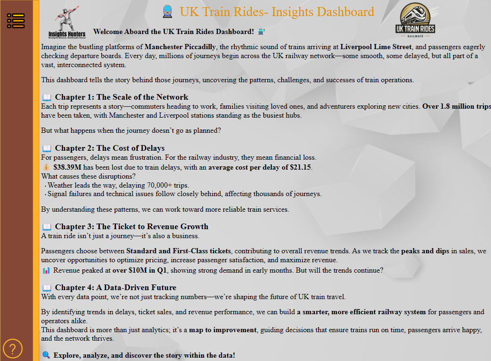  
*High-level landing page with key navigation and summary KPIs for executive users.*

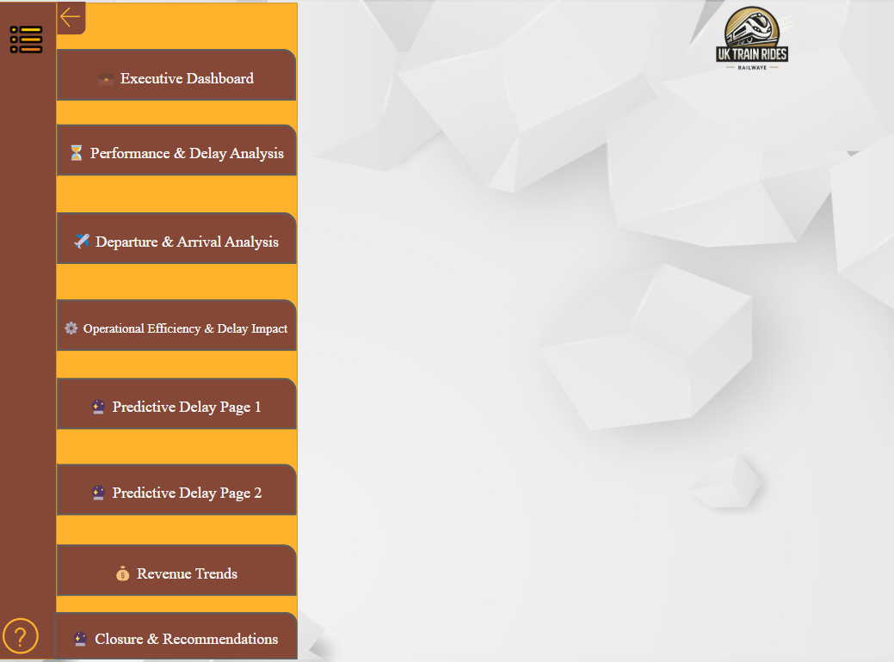  
*Interactive sidebar guiding users across strategic, analytical, and operational views.*

---


### 🧠 Strategic Dashboard  

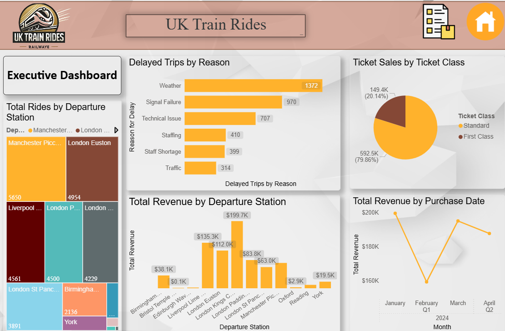  
*Breakdown of total rides, delays, revenue, and performance trends by station and time.*

---

### 📊 Analytical Dashboards  

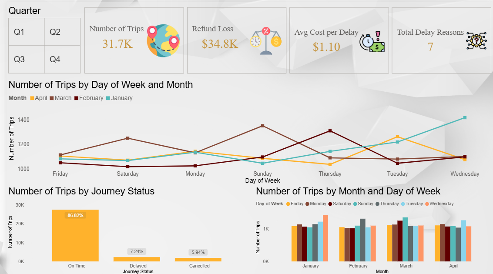  
*Overview of trip volumes, on-time performance, and customer behavior by ticket class.*

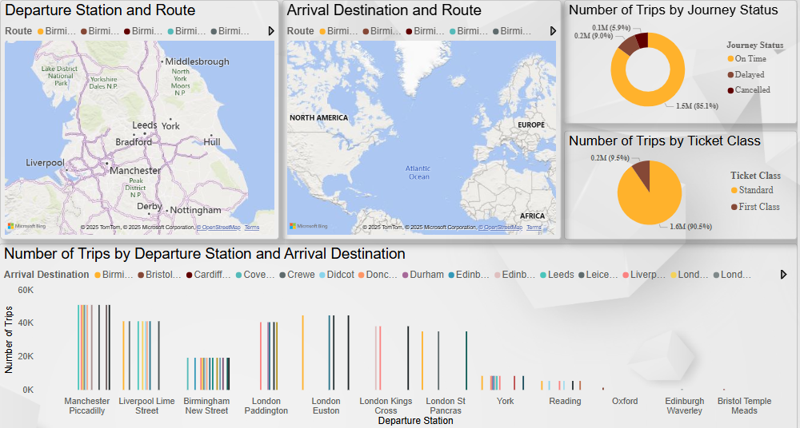  
*Insights into journey statuses and ticket distribution with map visualizations of key stations.*

---

### ⚙ Operational Dashboards  

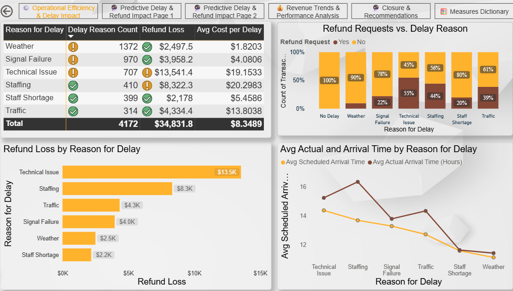  
*Delay cost distribution by reason and time, highlighting key financial inefficiencies.*

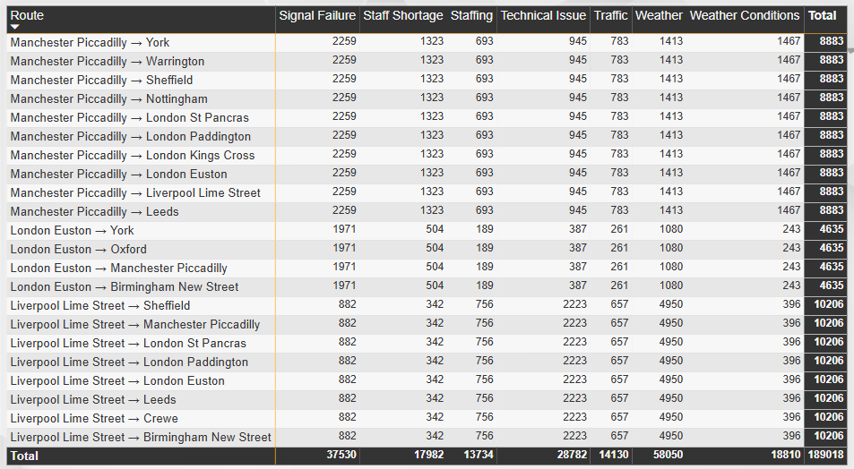  
*Detailed bar charts for delay frequency across routes and refund claims per reason.*

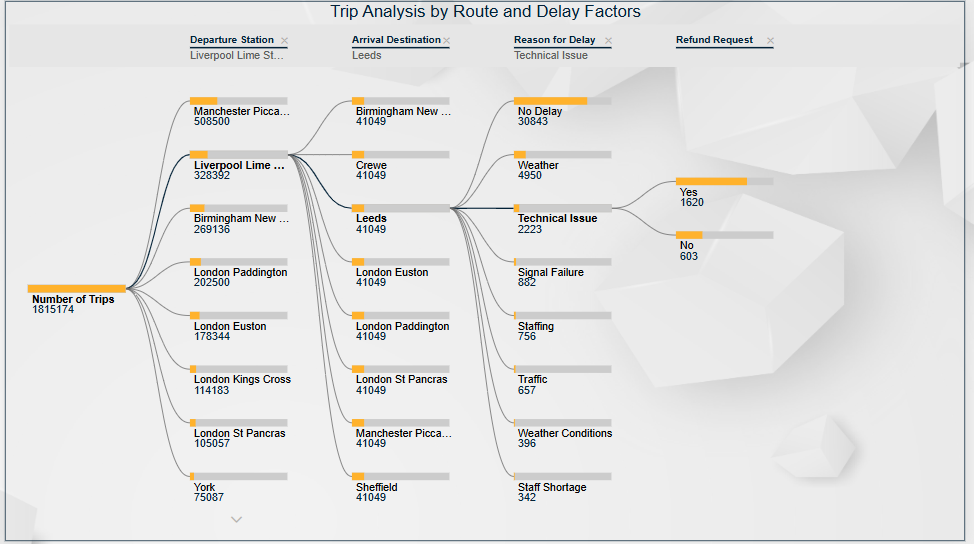  
*Time series comparing actual vs. scheduled arrival trends, with cause-based breakdowns.*

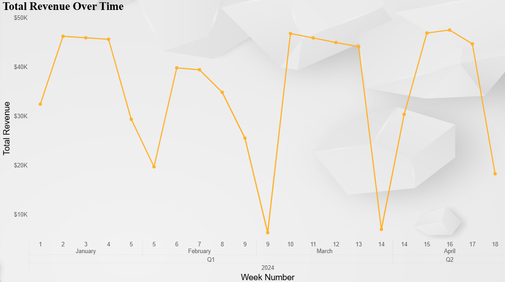  
*Revenue fluctuations linked to disruptions, including trip analysis and Sankey diagrams.*

---

### 💡 Recommendations & Q&A  

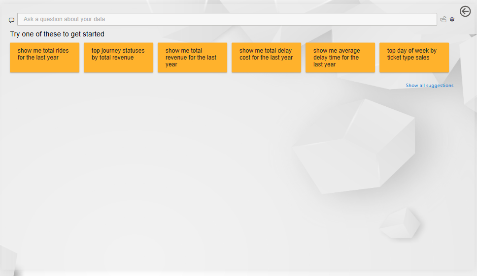  
*Business questions mapped to visuals, tying analysis back to real-world objectives.*

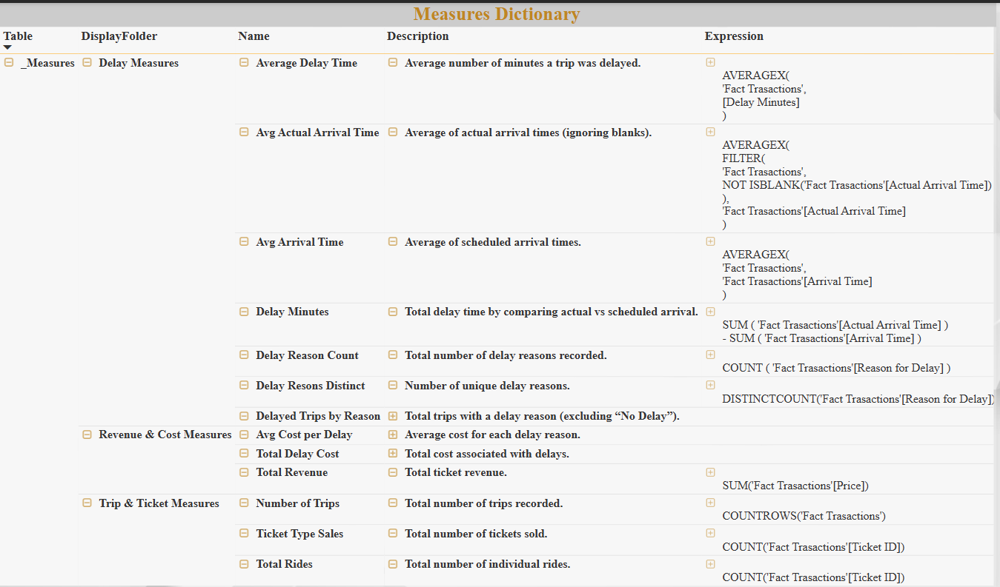  
*Field definitions and metadata to support transparency and maintain data understanding.*


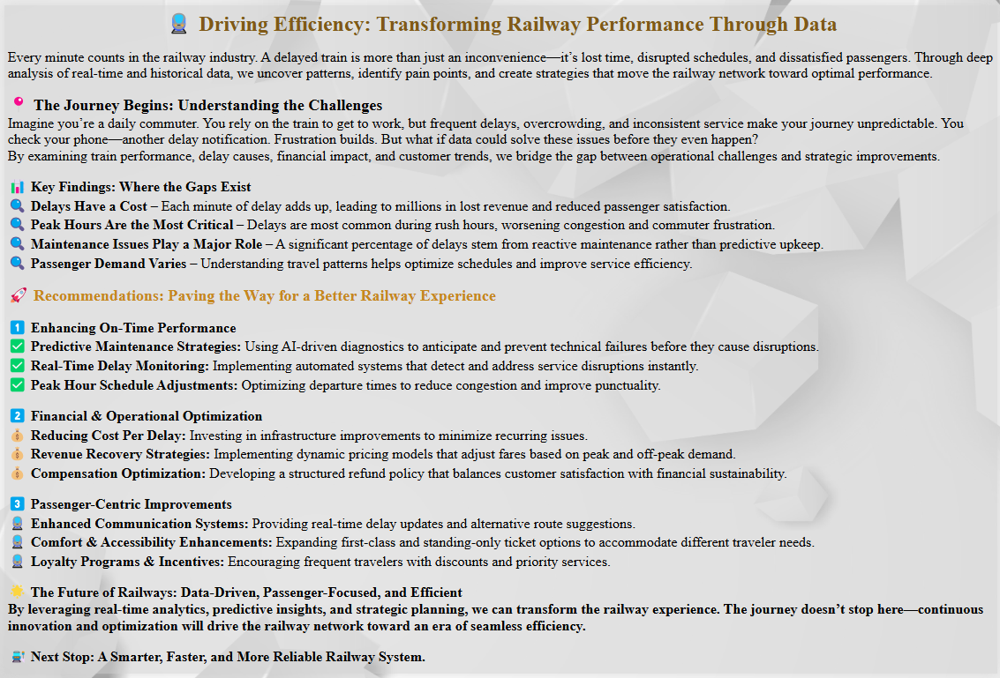  
*Strategic takeaways and future action points to enhance operations and customer trust.*

---

## 🚧 Challenges & Enhancements

### ❗ Challenges
- Inconsistent datetime formats and null values for canceled journeys
- Designing role-playing date dimensions for both **purchase** and **journey** dates
- Balancing **performance** with advanced visuals and calculations

### 🌱 Future Improvements
- 🔮 Machine Learning model to **predict delays**
- 💬 Sentiment analysis from **customer feedback**
- 📊 "What-if" pricing scenario modeling
- 🔗 Real-time data integration with APIs

---

## 🗂 Repository Structure

```
📦 UK-Train-Rides-Analytics
 ┣ 📁 assets/                    → Dashboard screenshots
 ┣ 📁 Data/                      → Cleaned CSVs or Excel (if public)
 ┣ 📁 Dashboard/                → Power BI .pbix file
 ┣ 📁 Docs/                      → PDF Reports or Docs
 ┣ 📁 Scripts/                   → SQL or Python code (optional)
 ┗ 📄 README.md                  → This file
```

---

## 👨‍💻 Maintainer

**Mazen Moustafa Sayem Abdel-tawwab**  
📧 mazen110.net@gmail.com  
📱 +20 155 565 7877  
🔗 [LinkedIn Profile](https://linkedin.com/in/mazen-abdel-tawwab)

---

> Made with ❤️  by **Insight Hunters**
